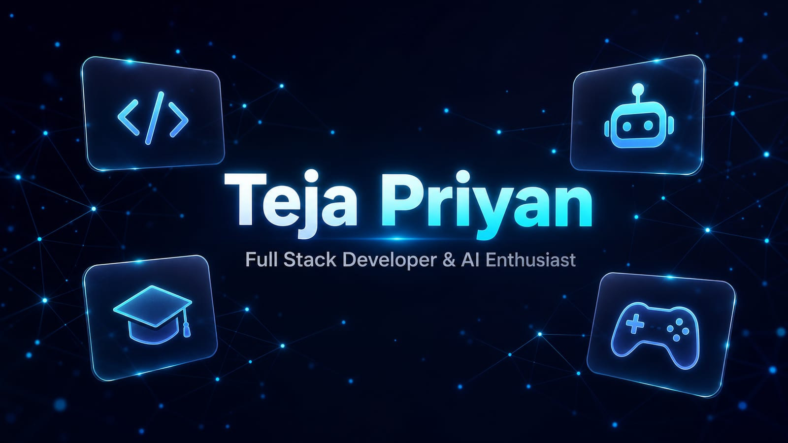

<h1 align="center">Teja Priyan — AI Engineer &amp; Full Stack Developer Portfolio</h1>

<p align="center">
  
</p>

<p align="center">
  <a href="https://portfoliotejapriyan.vercel.app/" target="_blank"></a>
  <a href="https://huggingface.co/teja161615/Tejapriyan-8B-GGUF" target="_blank"></a>
  <a href="LICENSE"></a>
  <a href="#-contributing"></a>
</p>

<p align="center">
  
  
  
  
  
  
  
</p>

---

## 📖 About

Official developer portfolio of **Teja Priyan** — an **AI Engineer & Full Stack Developer** actively researching, fine-tuning, and engineering cutting-edge artificial intelligence systems. Built as a high-performance, zero-build single-page application with a modern glassmorphism aesthetic, interactive particle engine, dual color themes, and comprehensive SEO / AEO / GEO optimizations.

> **Core Focus:** Fine-tuning open-weight Large Language Models (**Tejapriyan-8B**), architecting high-throughput multimodal AI platforms (**Teja Priyan AI**), developing real-time computer vision systems (OpenCV, YOLO), and building scalable full-stack web applications.

---

## ✨ Features

- 🧠 **Flagship AI Projects Showcased**:
  - **Teja Priyan AI** — Production-grade multimodal intelligence platform with sub-second streaming (`<0.4s` latency), 4 adaptive reasoning tiers, vision reasoning, and interactive live code/game sandbox.
  - **Tejapriyan-8B Model** — Custom 8-billion parameter LLM fine-tuned using SFT and GRPO for verifiable SQL reasoning (57.7% on Spider benchmark), runnable offline via Ollama and NPX CLI (`npx tejapriyan`).
- 🏷️ **Interactive Category Filters** — Smoothly filter projects between **All**, **AI & LLMs**, **Computer Vision**, and **Web & 3D Apps**.
- 🔍 **SEO, GEO & AEO Optimized**:
  - **Generative Engine Optimization (GEO)** & **Answer Engine Optimization (AEO)** designed for Perplexity, ChatGPT Search, Gemini, and Claude.
  - Comprehensive **JSON-LD Schema.org** graph (`Person`, `WebSite`, `SoftwareApplication`, `ItemList`, and `FAQPage`).
  - Google Search Console verification support (HTML tag & file).
- 🌗 **Dual Theme Toggle** — Ocean (cyan) 🌊 / Amethyst (purple) 🔮 themes, with selection persisted in `localStorage`.
- ✨ **Interactive Particle Canvas** — Dynamic particles that react to cursor hover and click ([particles.js](https://vincentgarreau.com/particles.js/)).
- ⌨️ **Dynamic Typing Headlines** — Cycling role titles reflecting AI engineering and full-stack expertise ([Typed.js](https://github.com/mattboldt/typed.js/)).
- 🫧 **Glassmorphism UI** — Frosted glass cards with glow hover effects, smooth transitions, and responsive layout.
- 🔢 **Animated Metric Counters** — Suffix-preserving counters (8+ Projects, 8B Parameters, 100% Dedication) triggering on scroll.
- 📄 **In-Page Resume Modal** — View, print, or download the HTML resume without leaving the page.
- ⚡ **Zero Build Step** — Pure modern HTML5/CSS3/Vanilla JS with CDN dependencies; instant deployment anywhere.

---

## 🧩 Sections

| Section | Description |
| --- | --- |
| **Hero** | Name, animated role headline, quick metric stats, and call-to-action buttons |
| **About** | AI engineering focus, educational background, and technical expertise |
| **Experience & Research** | Active AI research & LLM fine-tuning, full-stack training, and CS degree |
| **Skills** | AI, LLMs & Vision, Backend & Systems, and Frontend & Platform skill badges |
| **Projects** | Filterable grid across AI & LLMs, Computer Vision, and Web & 3D Apps |
| **Contact** | Direct channels: Email, GitHub, LinkedIn, and Hugging Face |
| **Resume Modal** | Full interactive resume with print & download options |

---

## 🛠️ Tech Stack

| Layer | Technologies |
| --- | --- |
| **AI & LLMs** | Fine-Tuning (SFT & GRPO), Qwen3-8B, Ollama, GGUF, Hugging Face, OpenCV, YOLO, TensorFlow |
| **Backend & Systems** | Python, Java, Spring Boot, SQL, PostgreSQL, SQLite, REST APIs, Streaming APIs, WebSockets |
| **Frontend & UI** | HTML5, CSS3 (Custom Variables), Tailwind CSS, Vanilla JavaScript, WebAssembly (Wasm) |
| **Animation & Effects** | particles.js, Typed.js, ScrollReveal, GSAP |
| **Icons & Assets** | Font Awesome |
| **Hosting & CI/CD** | Vercel |

---

## 📂 Project Structure

```
MyPortfolio/
├── index.html                   # Complete portfolio — markup, styles, scripts, SEO, and structured data
├── google87bb3bc53ec346d2.html  # Google Search Console verification file
├── assets/
│   └── banner.jpg               # Banner image used in this README
├── .github/
│   ├── ISSUE_TEMPLATE/          # Bug report & feature request templates
│   ├── PULL_REQUEST_TEMPLATE.md
│   └── CI.md                    # Ready-to-paste GitHub Actions workflow
├── .editorconfig                # Consistent editor formatting rules
├── .gitignore
├── .htmlvalidate.json           # html-validate configuration for CI
├── CODE_OF_CONDUCT.md
├── CONTRIBUTING.md
├── LICENSE                      # MIT License
├── README.md                    # Documentation
├── SECURITY.md
└── vercel.json                  # Vercel deployment configuration
```

---

## 🔗 Live Projects Featured in Portfolio

| Project | Domain | Live Link |
| --- | --- | --- |
| 🧠 **Teja Priyan AI Platform** | Multimodal AI Workspace | [tejapriyan-ai.vercel.app](https://tejapriyan-ai.vercel.app/) |
| ⚡ **Tejapriyan-8B Model & Playground** | Fine-Tuned 8B LLM | [tejapriyan-ai-model.vercel.app](https://tejapriyan-ai-model.vercel.app/) |
| 📦 **Tejapriyan-8B Weights** | Hugging Face GGUF | [huggingface.co/teja161615](https://huggingface.co/teja161615/Tejapriyan-8B-GGUF) |
| 🏨 **Hotel Booking System** | Full-Stack Java / SQL | [veltechhotel.onrender.com](https://veltechhotel.onrender.com/) |
| 🎮 **Gaming Hub Platform** | HTML5 Canvas Gaming | [tejagamehub.netlify.app](https://tejagamehub.netlify.app/) |
| 🧘 **Glass‑Tech Sanctuary** | Interactive Web Hub | [myself-tejapriyan.onrender.com](https://myself-tejapriyan.onrender.com/) |
| 🌐 **3D Interactive Portfolio** | 3D Web Portfolio | [portfoliotejapriyan.vercel.app](https://portfoliotejapriyan.vercel.app/) |

---

## 🚀 Getting Started

### Prerequisites

- Any modern web browser (Edge, Chrome, Safari, Firefox)
- (Optional) [Node.js](https://nodejs.org/) for local static serving or validation

### Run Locally

**Option 1 — Open directly:**

```bash
git clone https://github.com/TejaPriyan/MyPortfolio.git
cd MyPortfolio
start index.html       # Windows
open index.html        # macOS
xdg-open index.html    # Linux
```

**Option 2 — Serve with local HTTP server (recommended):**

```bash
# Using Node
npx serve .

# Or using Python
python -m http.server 8080
```

---

## 🌍 Deployment

The site is a single static file — it deploys anywhere in seconds.

<details>
<summary><strong>Vercel</strong> (current host)</summary>

1. Push this repository to GitHub
2. Go to [vercel.com/new](https://vercel.com/new) and import the repo
3. Vercel auto-detects static HTML — click **Deploy**

Or via Vercel CLI:

```bash
npm i -g vercel
vercel --prod
```

Settings for this repo are in [`vercel.json`](vercel.json).

</details>

<details>
<summary><strong>GitHub Pages</strong></summary>

1. Go to **Settings → Pages** in your GitHub repository
2. Under *Build and deployment*, choose **Deploy from a branch**
3. Select `main` / `root` and save

</details>

---

## 🤝 Contributing

Contributions, issues, and feature suggestions are welcome!
See [CONTRIBUTING.md](CONTRIBUTING.md) to get started and review our [Code of Conduct](CODE_OF_CONDUCT.md).

---

## 📄 License

This project is licensed under the [MIT License](LICENSE) — free to use, modify, and share.

---

## 📬 Contact & Links

- 🌐 **Portfolio**: [portfoliotejapriyan.vercel.app](https://portfoliotejapriyan.vercel.app/)
- 🤖 **Teja Priyan AI**: [tejapriyan-ai.vercel.app](https://tejapriyan-ai.vercel.app/)
- ⚡ **Tejapriyan-8B**: [tejapriyan-ai-model.vercel.app](https://tejapriyan-ai-model.vercel.app/)
- 💻 **GitHub**: [@TejaPriyan](https://github.com/TejaPriyan)
- 💼 **LinkedIn**: [in/tejapriyan](https://www.linkedin.com/in/tejapriyan)
- 🤗 **Hugging Face**: [teja161615](https://huggingface.co/teja161615)

---

<p align="center">Crafted with <span style="color:#22d3ee">♥</span> and code by <strong>Teja Priyan</strong></p>
